# Guide d'Installation et d'Utilisation de l'Extension Multi-clerc

## Partie 1 : Installation et utilisation basique

Cette partie vous guidera à travers les étapes pour installer et commencer à utiliser rapidement l'extension Multi-clerc avec ses fonctionnalités de base.

### Étape 1 : Installation de l'extension

1. Ouvrez le navigateur Google Chrome.
2. Accédez à la [page de l'extension Multi-clerc](https://chrome.google.com/webstore/detail/multi-clerk/kniepgejholpdfffnaoigofcpcljmdpb) sur le Chrome Web Store 
3. Cliquez sur le bouton "Ajouter à Chrome" pour installer l'extension.

    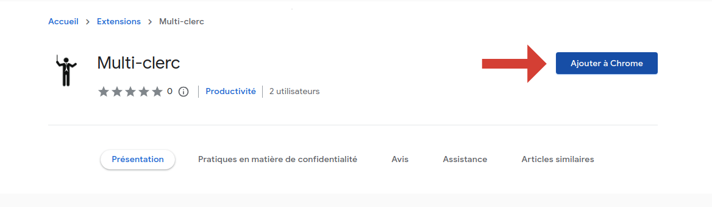

4. Cliquez sur la pièce de puzzle dans la barre d'outils de Chrome, et attachez l'icône de l'extension à la barre d'outils en cliquant sur la punaise.

    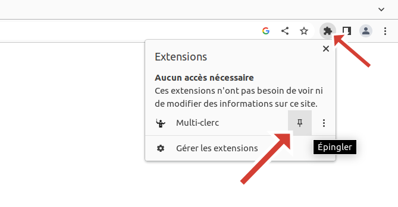

### Étape 2 : Fonctionnalités de base

1. Ouvrir les différentes interfaces de cyber-clerc dans le navigateur Chrome. Pour essayer l'extension, vous pouvez ouvrir une vente de test [sur Drouot](https://cyberdrouot.zonesecure.org/live-test) et [sur Interenchères](https://pro.interencheres.com).

Une fois que les interfaces de cyber clerc sont ouvertes, vous pouvez cliquer sur le logo de l'extension et commencer à utiliser les fonctionnalités de base.

2. Cliquez sur l'icône de l'extension Multi-clerc dans la barre d'outils de Chrome pour voir apparaître l'extension.

    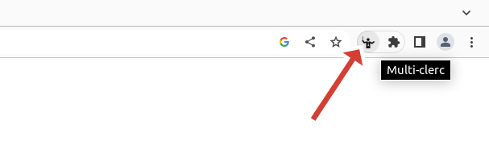

3. Vous devriez voir apparaître une ligne par interface de cyber-clerc ouverte dans des onglets.

    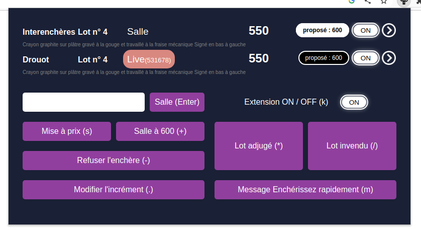

    L'extension est conçue pour pouvoir être utilisé exclusivement avec un clavier. Les raccourcis sont :

    Enter : Placer une enchère en salle au montant saisi

    s : Effectuer une mise à prix au montant saisi

    \+ : Placer une enchère en salle au montant proposé en ligne 

    \- : Annuler la dernière enchère sur toutes les plateformes

    . : Modifier l'incrément (fixe / automatique)

    \* : Adjuger le lot en cours

    / : Déclarer le lot comme invendu

    m : Afficher "Enchérissez rapidement" aux enchérisseurs live (pour les plateformes compatibles)

    k : Mettre l'extension en pause (l'extension ne déclenche plus d'actions sur les onglets)

## Partie 2 : Points importants

### Enchères lives

Si une enchère live est placée par un internaute sur une plateforme, l'extension place automatiquement une enchère en salle sur les autres plateformes.

Si plusieurs enchères lives arrivent en même temps, l'extension va considérer la première enchère qu'elle a reçue comme la gagnante et va écraser les autres enchères lives des autres plateformes avec une enchère en salle.

### Désactivation de l'extension

Il est possible de désactiver l'extension complètement en appuyant sur k, ou en cliquant ici :

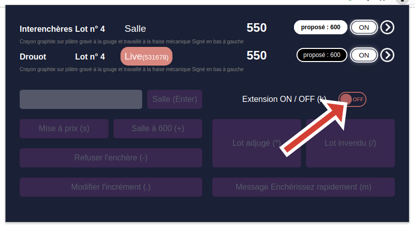

Si l'extension est désactivée, une enchère live n'entraînera plus la création d'enchères en salle.

Il est important de désactiver l'extension dans les cas de figure suivants : 

1. L'ajout d'un nouveau lot pendant la vente
2. Revenir sur un lot passé pendant une vente

Le cyber-clerc va devoir effectuer ces opérations sur les plateformes qui le supportent en dehors de l'extension. Toutefois, il ne faudrait pas à ce moment-là qu'une enchère live entraîne une enchère en salle sur les plateformes qui, ne supportant pas la fonctionnalité, sont sur un lot différent.

Il est aussi possible de désactiver une unique plateforme en cliquant ici :

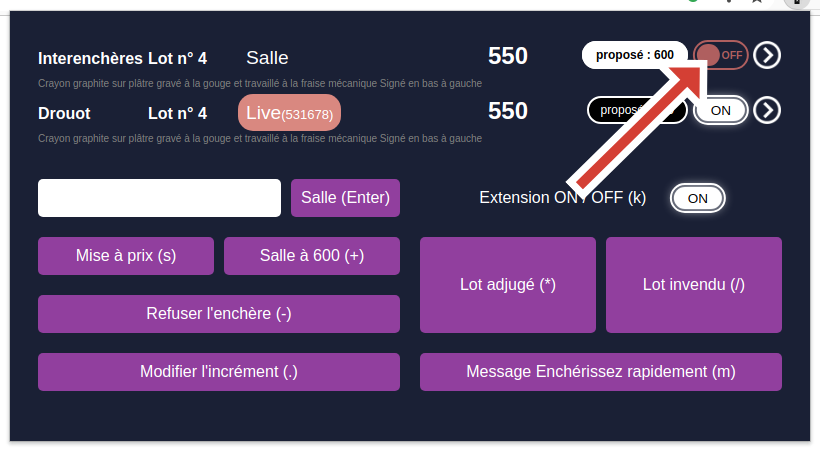

Si une plateforme est désactivée, les enchères lives de cette plateforme n'entraîneront plus la création d'enchères en salle sur les autres plateformes. De plus, aucune action de l'extension ne sera appliquée à cette plateforme (placer une enchère, supprimer la dernière enchère, effectuer une mise à prix, changer le pas d'enchère)

Cette fonctionnalité peut permettre par exemple de réaligner les lots d'une plateforme en désactivant les autres et en effectuant plusieurs fois l'action 'lot invendu'.

### Adjudication

Au moment ou le cyber-clerc adjuge le lot (*), l'extension prend une photographie de l'état actuel de la vente.

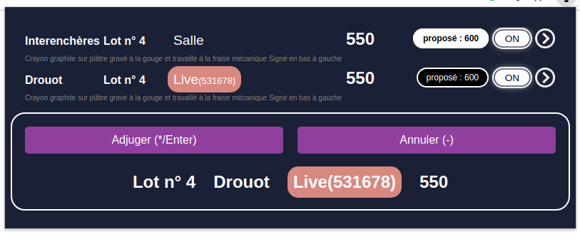

Tant que le cyber-clerc ne confirme pas l'adjudication, d'autres enchères peuvent arriver :

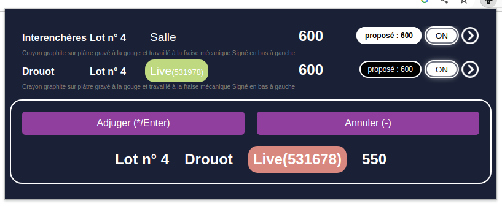

 Si le commissaire-priseur ne souhaite pas prendre en compte les enchères tardives, le cyber-clerc n'a qu'à confirmer l'adjudication (*). Si le commissaire-priseur souhaite reprendre la vente et prendre en compte les nouvelles enchères, il suffit d'annuler l'adjudication (-).

Si l'extension trouve une incohérence dans l'état des enchères, l'adjudication est interdite.

### Modifier le pas d'enchère

Il est possible de modifier le pas d'enchère :

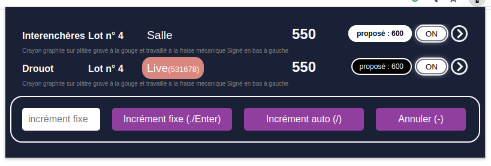

Si le champ de saisie est vide, alors les deux boutons 'Incrément fixe' et 'Incrément Auto' font la même chose : Incrément Auto.

En pratique, pour placer un incrément fixe, il faut taper : (.) montant (.)

Pour placer un incrément automatique, il faut taper : (.) (.) ou (.) (/)

## Partie 3 : Fonctionnalités secondaires

### Passer rapidement d'une interface de cyber-clerc à une autre

L'extension permet de changer rapidement l'onglet actif de Google Chrome pour passer d'une plateforme à une autre :

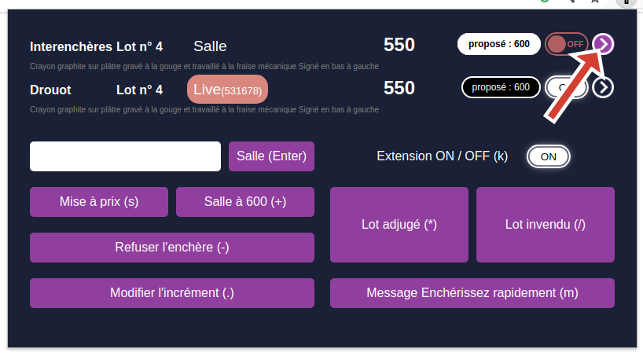

### Changer la référence de l'enchère en salle proposée

L'extension propose de placer une enchère en salle au montant proposé sur internet (+).
Il est possible que les différentes plateformes proposent un montant différent aux internautes sur le même lot.
L'extension permet de se baser sur une plateforme plutôt qu'une autre pour mettre à jour le montant de cette enchère en salle :

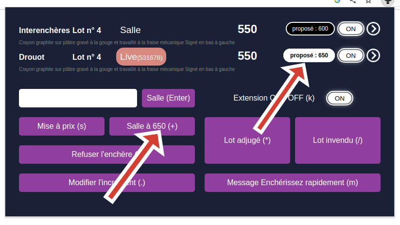